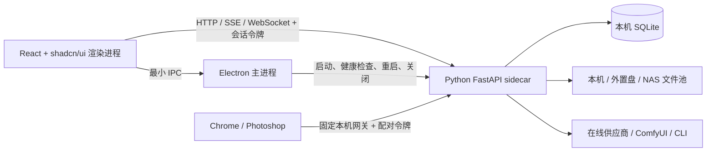

# Infinite Canvas Studio 技术架构

## 1. 架构原则

1. **本地优先**：无账号、无网络、无 API Key 也能启动并使用本地功能。
2. **单一数据所有者**：只有 Python sidecar 读写 SQLite。
3. **大文件与结构化数据分离**：SQLite 存关系与索引，文件存储保存媒体。
4. **深模块**：模块公开少量稳定接口，内部封装事务、鉴权、迁移和错误处理。
5. **契约先行**：HTTP、事件、IPC、插件协议和导出格式均版本化。
6. **可替换实现**：复刻用户行为，不复制上游巨型单文件和浏览器服务架构。

## 2. 运行时拓扑



Electron 主进程只管理桌面生命周期和系统能力。业务调用不经过一百多个 IPC 转发，而由本地打包的 React 代码使用类型化客户端直连随机端口 sidecar。sidecar 和扩展网关都只监听 `127.0.0.1`，但使用不同令牌与权限域。

## 3. 仓库模块

```text
apps/desktop             Electron main/preload、sidecar supervisor、打包
apps/renderer            React、shadcn/ui、画布与桌面工作区
services/backend         FastAPI 应用及领域模块
packages/contracts       HTTP、IPC、事件和插件共享契约
packages/canvas-model    画布文档与操作模型
extensions/chrome        Manifest V3 采集扩展
extensions/photoshop     Photoshop UXP 插件
tests/parity             冻结基线逐项验收
tests/e2e                桌面端到端与安装冒烟
reference                固定提交的只读上游 submodule
```

后端目标结构：

```text
services/backend/src/infinite_canvas_studio/
  api/                   内部 API 与配套组件网关
  core/                  配置、日志、错误、生命周期、安全
  modules/
    projects/            项目与画布编排
    assets/              内容寻址、缩略图、回收站
    tasks/               持久化任务与并发调度
    providers/           供应商注册、能力与凭证引用
    workflows/           工作流定义和执行
    history/             生成历史、操作日志、快照
    backup/              自动备份、恢复与数据库升级保护
    integrations/        Chrome、Photoshop 配对与协议
  infrastructure/
    database/            SQLAlchemy、Alembic、repositories
    storage/             本地/外置/NAS 驱动
    ffmpeg/              媒体探测、首帧和抽帧
```

每个领域模块对外暴露应用服务与端口接口；API 路由、SQLAlchemy 模型和供应商 SDK 只是适配器，不能成为跨模块依赖中心。

## 4. 启动与通信

### 4.1 启动序列

1. Electron 获得单实例锁并加载最小引导配置。
2. 校验资料库路径；缺失时只启动恢复 UI，不开放业务写入。
3. 选择空闲端口，生成高熵临时会话令牌并启动平台 sidecar。
4. 轮询 `/v1/health`，验证协议版本、进程身份和资料库状态。
5. 将端口和令牌通过受限 preload API 注入本地渲染进程。
6. sidecar 异常时限次重启；连续失败进入诊断模式。

### 4.2 IPC 白名单

IPC 仅包含选择目录、在文件管理器显示、打开 HTTPS 外链、窗口/托盘控制、开机启动、系统信息和安全退出等桌面能力。每个 handler 校验调用来源和参数，preload 不暴露通用 `send`、文件系统或 shell 执行能力。

### 4.3 API 与事件

- REST：查询和命令，统一使用 `/v1` 前缀和 Problem Details 风格错误。
- SSE：流式聊天、日志和单向进度。
- WebSocket：任务、素材和画布实时事件，不承载“在线人数”。
- 幂等性：可能重复提交的创建命令使用客户端请求 ID。
- 版本：插件协议、导出格式和画布 schema 使用独立主版本。

## 5. 数据架构

### 5.1 SQLite

SQLite 始终位于本机，由 Python 单独持有连接。启用外键、WAL、busy timeout 和显式事务。SQLAlchemy 管理实体与 Unit of Work，Alembic 管理单向升级；升级前创建保护备份，旧应用遇到新 schema 时拒绝写入。

核心表族：

- `projects`、`canvases`、`canvas_nodes`、`canvas_edges`
- `canvas_operations`、`canvas_snapshots`、`recovery_sessions`
- `assets`、`asset_sources`、`asset_references`、`trash_entries`
- `providers`、`provider_credentials`、`provider_capabilities`
- `tasks`、`task_attempts`、`generation_history`
- `workflows`、`workflow_versions`
- `paired_clients`、`inbox_items`
- `settings`、`backup_records`、`schema_metadata`

节点的 ID、类型、位置、尺寸和版本为结构化列；节点特有参数放入带 schema 版本的 JSON 字段。画布命令在一个事务中更新实体并追加操作日志，定期压缩为快照，默认保留 100 次撤销记录。

### 5.2 文件存储

```text
library-root/
  infinite-canvas.sqlite3
  managed/               本机或外置盘文件池
    sha256/ab/cd/<hash>
  workflows/
  exports/
  backups/               默认 3 份自动数据库备份
  cache/
  recovery/
```

大型文件可以把 `managed/` 映射到 NAS/SMB。SQLite、凭证和恢复日志仍在本机。文件写入采用“临时文件 → fsync → SHA-256 → 原子重命名 → 数据库提交”，避免数据库引用半文件。

共享 NAS 文件不可变。每台设备发布自己的哈希引用清单；物理删除只能由用户启动全局扫描后执行，长期离线设备会触发警告。项目、历史和任务不通过 NAS 同步。

### 5.3 存储迁移

更改存储位置时：暂停任务和写入，复制到临时目标，校验数量/大小/哈希，原子切换引导配置，重新打开并执行完整性检查，最后由用户决定是否删除旧目录。

## 6. 任务与供应商

任务状态机为 `queued → running → succeeded | failed | canceled`。任务入库后再执行，重启时只恢复协议明确支持恢复的远程查询；失败不自动重试，避免重复计费。

调度限制默认值：

| 范围            | 默认并发 |
| --------------- | -------: |
| 全局            |        4 |
| 单在线供应商    |        2 |
| 单 ComfyUI 实例 |        1 |

供应商模块通过统一能力接口暴露文本、图片、视频和异步任务；适配器负责协议差异。ComfyUI 注册实例能力清单，调度器只选择具备所需模型、节点和工作流且队列较短的实例。

## 7. 安全与隐私

- BrowserWindow 使用 `contextIsolation: true`、`sandbox: true`、`nodeIntegration: false`。
- 生产 CSP 禁止远程脚本和任意连接，只允许当前随机本机 API 地址。
- 内部会话令牌只存在于当前进程生命周期；扩展令牌独立签发、可撤销并限制能力。
- API Key 按已确认产品决策可明文保存，但必须与共享文件分离、限制文件权限，并从日志、备份、导出和诊断包排除。
- 所有输入文件执行大小、MIME、扩展名、路径穿越和解压炸弹检查。
- 外部 URL 只允许 HTTPS，未知域名提示确认，最终交给系统浏览器。
- Chrome 全站权限仅在用户主动触发时读取页面；内容脚本不能读取配对令牌。

## 8. 备份与恢复

- 每日一致性备份：SQLite、工作流和轻量配置，保留 3 份。
- 升级保护备份：不计入自动轮换，迁移成功并稳定后才允许删除。
- 完整备份：用户手动选择目标，包含媒体并生成校验清单。
- 崩溃恢复：操作日志生成候选恢复版本，不自动覆盖正式画布。
- 整库恢复：先保护当前库，再替换、校验 schema 和素材引用。

## 9. 构建与发布

GitHub Actions 分别在 `windows-latest` 和 ARM64 `macos-15` 构建：

1. 安装 Node 22、pnpm 10、Python 3.12。
2. 运行格式、lint、TypeScript 类型检查、Python Ruff/Pytest 和矩阵校验。
3. 用 PyInstaller 构建当前平台 sidecar。
4. 构建 renderer 与 Electron main。
5. 使用 electron-builder 生成 NSIS/ZIP 或 arm64 DMG/ZIP。
6. 生成 SHA-256，并在 tag 工作流上传 GitHub Release。

无签名构建可能触发 Windows SmartScreen 和 macOS Gatekeeper。应用不使用自动替换更新，只打开 GitHub Release 下载页。

## 10. 验证策略

- 单元测试：画布操作、存储路径、哈希去重、调度与鉴权。
- 契约测试：每个供应商、插件协议、HTTP 错误与事件 schema。
- 集成测试：SQLite 事务、迁移、备份、文件写入和 sidecar 生命周期。
- E2E：首次启动、画布、任务、导入导出、配对和恢复。
- 打包冒烟：在最低支持系统安装、启动、保存、重启与卸载。
- 复刻验收：每个 `IC-*` 条目关联测试或人工证据，未批准缺口阻断 `1.0.0`。

## 11. 架构决策记录

后续重大变更必须在 `docs/architecture/` 中新增 ADR，至少包含上下文、决策、替代方案、后果和回滚条件。首批 ADR 应覆盖：进程通信、SQLite 所有权、内容寻址存储、插件配对和公开导出格式。
